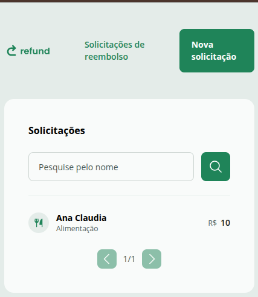
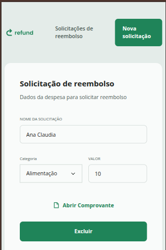
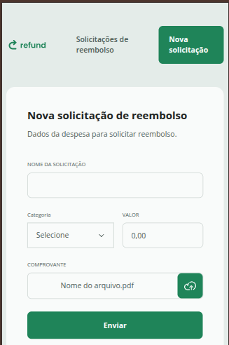

# Refund

O Refund é uma aplicação web para gerenciar solicitações de reembolso de despesas. A interface permite cadastrar novas solicitações, anexar comprovantes, visualizar o status das solicitações e acompanhar os detalhes de cada pedido de forma simples e organizada.

## 🚀 Sobre o projeto

Esta aplicação foi desenvolvida em React + TypeScript com Vite e tem como objetivo facilitar o fluxo de reembolso de gastos dentro de uma organização. O usuário pode:

- visualizar a lista de solicitações;
- buscar solicitações por nome ou categoria;
- criar uma nova solicitação com título, categoria, valor e comprovante;
- confirmar o envio após o cadastro;
- abrir os detalhes de uma solicitação e visualizar o comprovante;
- excluir uma solicitação quando necessário.

## 🖼️ Screenshots







## 🛠️ Tecnologias utilizadas

- React
- TypeScript
- Vite
- Tailwind CSS
- React Query
- Axios
- Zod
- React Router

## ▶️ Instalação

1. Clone o repositório:

```bash
git clone https://github.com/anacnogueira/refund.git
cd refund
```

2. Instale as dependências:

```bash
pnpm install
```

3. Crie um arquivo `.env` na raiz do projeto com a URL da API utilizada pela aplicação:

```env
VITE_API_URL=http://localhost:3333
```

> Ajuste a URL conforme o ambiente da sua API.

4. Inicie o projeto em modo de desenvolvimento:

```bash
pnpm dev
```

A aplicação ficará disponível em `http://localhost:5173`.

## 📜 Scripts disponíveis

- `pnpm dev` — inicia o servidor de desenvolvimento
- `pnpm build` — gera a build de produção
- `pnpm preview` — visualiza a build localmente
- `pnpm lint` — executa a análise de lint do projeto

## 📁 Estrutura principal

- `src/pages` — páginas da aplicação
- `src/components` — componentes reutilizáveis
- `src/contexts` — lógica de negócio e hooks relacionados a reembolsos e comprovantes
- `src/helpers` — configurações auxiliares, como a API
- `src/assets/snapshots` — imagens ilustrativas do projeto

## ✅ Observação

Para que a aplicação funcione corretamente, é necessário que a API de backend esteja disponível e configurada na variável `VITE_API_URL`.
